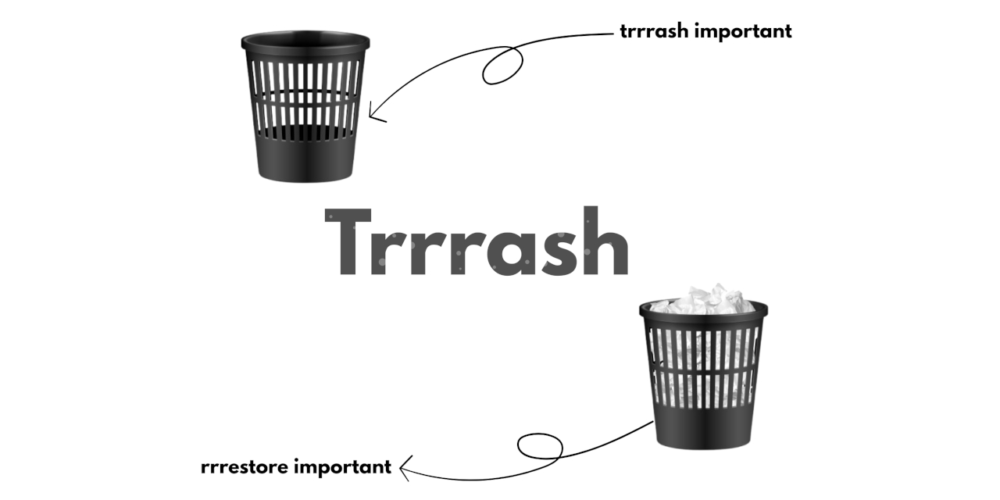

<p align="center">
  
</p>

<h1 align="center">Trrrash</h1>
<h2 align="center">Trash Bin – Bash Script</h2>
<h3 align="center">
  A lightweight alternative to the <code>rm</code> command that moves files to a custom trash folder instead of deleting them permanently.
</h3>

---

## Features

- Safe delete using `trrrash` instead of `rm`
- Restore files by name using `rrrestore`
- Empty trash using `emmmpty`
- Automatically creates `~/.trash` if it doesn't exist
- Beginner-friendly and portable

---

## Usage

### Move file to trash
```bash
trrrash filename
```
### Restore file from trash
```bash
rrrestore filename
```
### Empty trash bin
```bash
emmmpty
```
