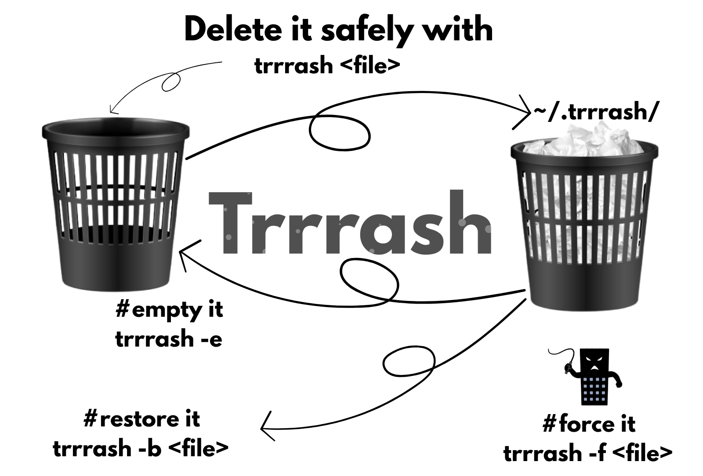

<p align="center">
  
</p>

<h1 align="center">Trrrash</h1>
<h2 align="center">Trash Bin – Bash Script</h2>
<h3 align="center">
  A lightweight alternative to the <code>rm</code> command that moves files to a custom trash folder instead of deleting them permanently.
</h3>

---

## Features

- Safe delete using `trrrash` instead of `rm`
- Restore files by original name using `trrrash -b <filename>`
- Empty the trash using `trrrash -e`
- Confirmation prompts with `-i` or force delete with `-f`
- Metadata stored for each deleted file

---

## Usage

```bash
trrrash file1.txt file2.sh      # Safely delete files
trrrash -f file.txt             # Force delete (no confirmation)
trrrash -i file.txt             # Interactive delete (ask before)
trrrash -b file.txt             # Restore by original name
trrrash -e                      # Empty the trash folder
trrrash --help                  # Show help message
trrrash --version               # Show version and author info
```
---
## Installation

- `git clone https://github.com/husseinMohamed7/trrrash.git`
- `cd trrrash`
- `chmod u+x install.sh`
- `./install.sh`

---

### Trash location

`~/.trrrash/`
- Each file is renamed with a timestamp suffix and gets a corresponding .meta file storing:
  - Original name and full path
  - Trashed name
  - Deletion timestamp
    
---

### Author
Your feedback is always welcome!


<p align="center">
  <a href="https://www.linkedin.com/in/hussein-mohamed7/" target="_blank">
    
  </a>
</p>

<h3 align="center"><a href="https://github.com/husseinMohamed7">Hussein Mohamed</a></h3>

<h3 align="center">
  
</h3>

